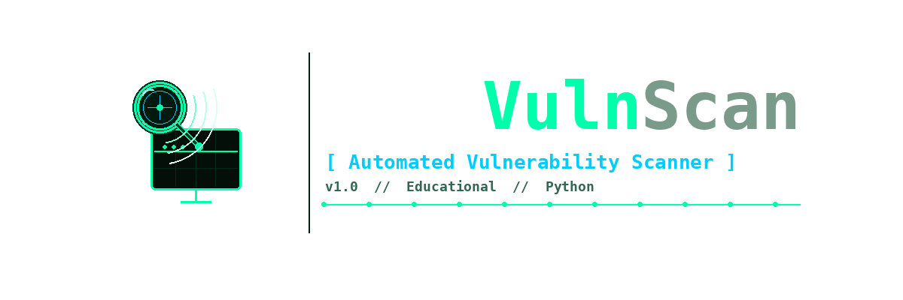

<p align="center">
  
</p>

<p align="center">
  <strong>Stealth-first automated vulnerability scanner — pure Python.</strong>
</p>

<p align="center">
  
  
  
  
</p>

---

## Overview

AutoVulnScan automates a practical vulnerability assessment workflow from a single terminal interface. It performs host discovery, port scanning, service and OS fingerprinting, CVE correlation against the NIST NVD, optional exploit validation, and produces clean HTML and JSON reports — all without installing Nmap or any binary dependencies.

The interface is a **page-based TUI** with full arrow-key navigation, not a flags-driven CLI.

---

## Pipeline

```
Host Discovery (optional)
      │
      ▼
  Port Scan  ──────────────────────────────── stealth profile applied
      │
      ▼
  Service Identification  ─────────────────── protocol-aware banner probes
      │
      ▼
  OS Detection  ───────────────────────────── SMB negotiate handshake
      │
      ▼
  CVE Matching  ───────────────────────────── NVD CPE → keyword → internal KB
      │
      ▼
  Exploit Validation  ─────────────────────── non-destructive checks only
      │
      ▼
  Report Generation  ──────────────────────── HTML + JSON
```

---

## Features

### Stealth-First Scanning

Every scan is designed to minimize noise on the wire:

- Randomized probe and port ordering
- Per-profile delay and jitter controls
- Bounded thread concurrency
- Passive-first banner grabbing
- Clean socket teardown on every connection
- TCP-based host liveness — no ICMP dependency

### Stealth Profiles

| Profile  | Delay  | Jitter  | Threads | Timeout | Intended Use         |
|----------|-------:|--------:|--------:|--------:|----------------------|
| `normal` | 0.0 s  | 0.0 s   | 50      | 0.5 s   | Fast internal audits |
| `quiet`  | 0.05 s | 0.05 s  | 25      | 1.0 s   | Balanced stealth     |
| `ghost`  | 0.2 s  | 0.15 s  | 10      | 1.5 s   | Maximum evasion      |

### Windows Service and OS Accuracy

Standard banner grabbing fails on Windows RPC/SMB/NetBIOS. AutoVulnScan uses protocol-aware probing:

- SMB dialect extraction (e.g., `SMB 3.1.1`)
- OS generation classification (`modern` vs `legacy`) via SMB negotiate
- RPC, NetBIOS, and SMB identified through actual protocol handshakes, not text patterns

### CVE Intelligence with False-Positive Controls

`cve_lookup/cve_match.py` applies a layered matching strategy:

1. **NVD CPE query** — most precise, fewest false positives
2. **NVD keyword query** — broader fallback for unrecognized services
3. **Internal curated KB** (`known_cves.py`) — when API quality is low or rate-limited

Each result then passes through:

- Platform relevance filtering via `cpe_filter.py`
- Service-topic checks (SMB, RPC, NetBIOS topic gating)
- Version range filtering where CPE range data is available
- CVSS threshold gate (`>= 7.0` by default)
- **Modern patch-state suppression** — CVEs flagged `patched_in_modern=true` are suppressed when the detected OS generation is `modern`

### Deduplicated Reporting

The per-port CVE structure is preserved in full in JSON for downstream tooling. A deduplicated view is computed for display via `deduplicate_cve_results()`, merging duplicate CVE IDs across ports. The HTML report shows one CVE row per unique ID with a merged ports column (e.g., `139, 445`).

### Safe Exploit Validation

- No payload execution, no system commands
- Connection-level checks only
- Current validator: `CVE-2011-2523` vsftpd 2.3.4 backdoor pattern

---

## Installation

**Requires:** Python 3.8+

```bash
git clone https://github.com/MohmedhKA/AutoVulnScan.git
cd AutoVulnScan
pip install -r requirements.txt
```

Dependencies: `requests`, `python-dotenv`

---

## Configuration

### NVD API Key

```bash
cp .env.example .env
```

Edit `.env`:

```env
NVD_API_KEY=your_key_here
```

Obtain a free key at [nvd.nist.gov/developers/request-an-api-key](https://nvd.nist.gov/developers/request-an-api-key).

Key resolution order:

1. `NVD_API_KEY` from environment or `.env`
2. `api.txt` (legacy fallback)

If the key is rejected with `403` or `404`, the scanner automatically retries in unauthenticated mode (rate-limited to 5 requests / 30 s).

---

## Usage

### Launch

```bash
python main.py
```

### TUI Flow

```
1. Welcome screen
2. Select target mode:
     a. Discover hosts on subnet  →  sweep + select from live hosts
     b. Enter target IP directly
3. Set port range and stealth profile
4. Pipeline runs phase by phase with live output
5. Results dashboard
6. Save HTML / JSON report
```

### Keyboard Controls

| Key        | Action              |
|------------|---------------------|
| `↑` / `↓` | Navigate menu       |
| `Enter`    | Confirm / select    |
| `ESC`      | Go back             |

---

## Running Modules Directly

Each module can be invoked standalone for testing:

```bash
# Host discovery
python scanner/network_sweep.py 192.168.1.0/24

# Port scan
python scanner/port_scan.py 192.168.1.10 1 1024

# Service identification
python scanner/service_id.py 192.168.1.10 135 139 445

# OS detection
python scanner/os_detect.py 192.168.1.10

# NVD keyword lookup
python cve_lookup/nvd_api.py "OpenSSH 8.2"

# CVE matching from synthetic service map
python cve_lookup/cve_match.py 192.168.1.10 445:SMB_3.1.1 135:Microsoft_Windows_RPC
```

---

## Report Output

| File | Contents |
|------|----------|
| `scan_<target>_<timestamp>.json` | Full per-port data — services, CVEs, OS info, validation |
| `scan_<target>_<timestamp>.html` | Deduplicated CVE table, optimized for readability |

---

## Project Structure

```
AutoVulnScan/
├── main.py                   # TUI application entry point
├── config.py                 # Stealth profiles, settings, API key loader
├── assets/
│   └── logo.png              # Project logo
├── scanner/
│   ├── network_sweep.py      # TCP-based host discovery
│   ├── port_scan.py          # Stealth port scanner
│   ├── service_id.py         # Protocol-aware banner grabbing
│   └── os_detect.py          # SMB OS fingerprinting
├── cve_lookup/
│   ├── nvd_api.py            # NIST NVD API client
│   ├── cve_match.py          # Multi-strategy CVE matching
│   ├── cpe_filter.py         # CPE-based relevance filtering
│   └── known_cves.py         # Internal curated CVE knowledge base
├── exploits/
│   └── validator.py          # Non-destructive exploit validators
├── report/
│   └── generate.py           # HTML + JSON report generator
├── requirements.txt
├── .env.example
└── .gitignore
```

---

## Security Notes

Never commit sensitive runtime files. The `.gitignore` is preconfigured to exclude:

```
.env
api.txt
cve_cache.json
scan_*.html
scan_*.json
```

---

## Disclaimer

AutoVulnScan is built for **educational purposes and authorized security assessments only**. Scanning systems without explicit permission is illegal. Use responsibly and only on infrastructure you own or have written authorization to test.
